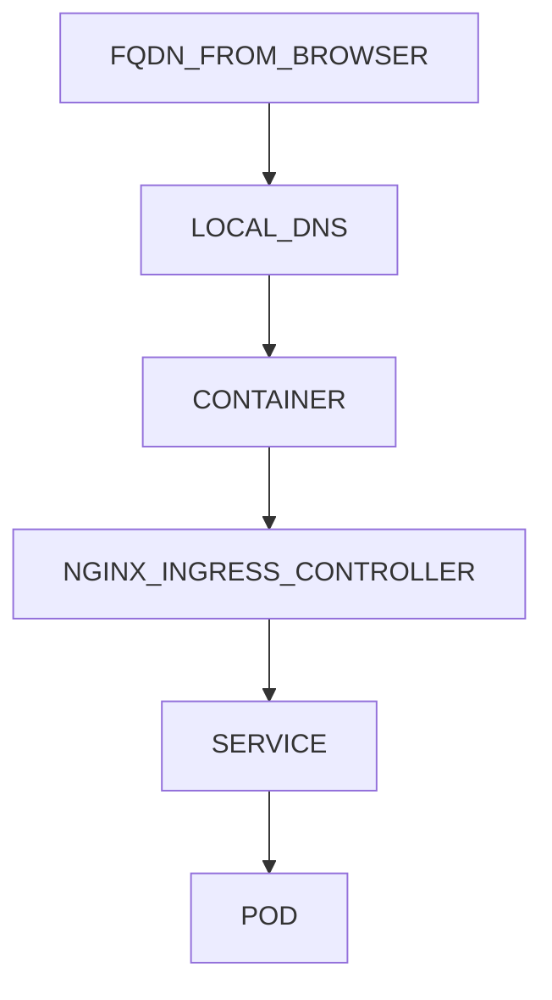
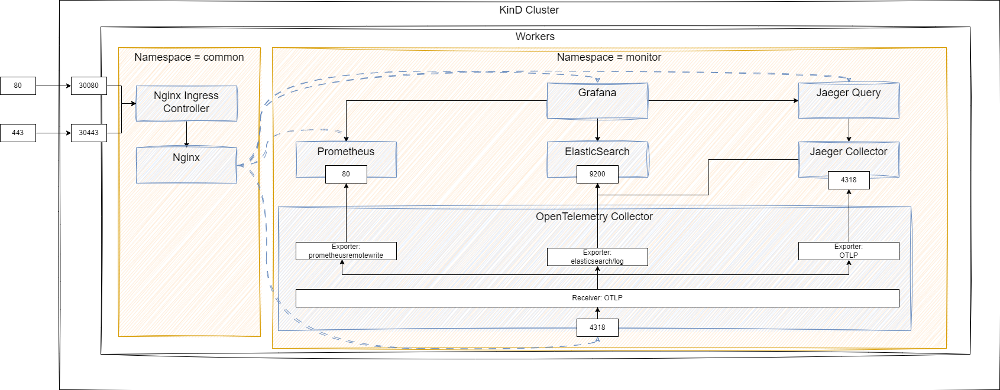

# Kubernetes Playground
A playground for getting familiar with Kubernetes. Plan to address the following components:
- [x] Ingress
- [x] Deploy opensource microservices with Helm
- [ ] Monitoring with Kubernetes (Metric, Log, Trace)
- [ ] Taint & Tolerance
- [ ] Deploy own application by writing own Helm Charts

# Development Environment
Here is the environment description when I am creating this stack.
## Operating System
* Windows 10

## Windows Subsystem for Linux 2 (WSL2)
* Ensure WSL2 is installed if you want to follow. You can follow [Microsoft's offical documentation](https://learn.microsoft.com/en-us/windows/wsl/install) for instructions on how to install WSL2.

## KinD (Kubernetes in Docker)
* [Install Docker Desktop for Windows](https://docs.docker.com/desktop/install/windows-install/) if not already installed.
* For KinD installation, please refer to [#Setup-Instructions] setting

# Setup Instructions
## WSL2 Side
The dependencies like `kind`, `kubectl` can be installed and spin-up cluster inside WSL2.
1. Clone the repository
   ```bash
   git clone https://github.com/K-T-Ng/kubernetes-playground.git
   cd kubernetes-playground
   ```
2. Install `make`
   ```bash
   sudo apt-get install make
   ```
3. Install dependencies (`kind`, `kubectl` and `helm`)
   ```sh
   make install-prerequisite get-helm-charts
   ```
4. Spin up cluster, this requires some waiting time (based on your network speed, due to pulling images are needed)
   ```sh
   make create-cluster
   make install-common check-common
   make install-monitor-backend check-monitor-backend
   ```

## Windows 10 Side
In order to make the `Ingress` works (e.g. If you want to access application inside KinD using DNS name rather than IP & Port), you may need to config some DNS settings in Windows 10 side.

The principle of this setting is to fake the local DNS, route FQDN to 127.0.0.1. Then the chain is something like the following:


1. You may find the `hosts` setting file in `C:\Windows\System32\drivers\etc`.
2. Open `hosts` file, add the following content.
   ```txt
   127.0.0.1 grafana.local prometheus.local jaeger.local otel-collector.local
   ```
3. Save it into somewhere you can access (e.g. Desktop)
4. Drag the file to `C:\Windows\System32\drivers\etc` and replace the existing `hosts` file. This enable us to access the UI/Endpoint using human readble DNS name.

# Clean Up Instruction
Delete the KinD cluster by issuing the following command:
```sh
make delete-cluster
```

# Overall Architecture


# Reference
- [KinD Documentation](https://kind.sigs.k8s.io/)
- [KinD Nginx Ingress Controller Setup](https://kind.sigs.k8s.io/docs/user/ingress/#ingress-nginx)
- [Config `hosts` File In Windows](https://blog.gtwang.org/windows/windows-linux-hosts-file-configuration/)
